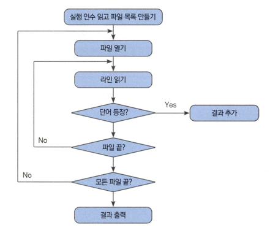

# 단어 검색 프로그램 만들기

## 미션
여러 텍스트 파일에서 원하는 단어를 검색합니다.
## 조작법
- find 찾을단어 대상텍스트파일
- 예) find word *.txt
## 주요 패키지
- os, path/filepath, strings, bufio

---


1. 찾으려는 단어와 파일 경로를 입력받습니다. 프로그램은 입력받은 인수를 읽어서 사용해야합니다.
2. 경로에 해당하는 파일을 찾습니다. 파일 경로는 특정 파일 하나만 나타낼 수 있고(와일드 카드로 표현되어) 여러 파일을 나타낼 수도 있습니다.
3. 파일을 읽고 각 라인에서 단어가 나오는지 확인합니다.
4. 특정 단어가 등장하는 라인을 취합하여 마지막으로 결과를 출력해야 합니다.

---
## 순서도로 나타내기


## 파일 열기

```go
func Open(name string) (*File, error)
```
*File 타입은 io.Reader 인터페이스를 구현하고 있기 때문에 bufio 패키지의 `NewScanner()` 함수를 통해 스캐너 객체를 만들어서 사용할 수 있습니다.

## 파일 목록 가져오기
```go
func Glob(pattern string) (matches []string, err error)
```

파일 경로를 넣어주면 해당하는 파일 리스트를 []string 타입으로 반환합니다.
```go
filepaths, err := filepath.Glob("*.txt")
```

## 파일 한 줄씩 읽기
```go
func NewScanner(r io.Reader) *Scanner
```

```go
type Scanner
    func (s *Scanner) Scan() bool
    func (s *Scanner) Text() string
```
Scan() 메서드는 다음 줄을 읽어오고 Text()는 읽어온 한 줄을 문자열로 반환합니다. 이 두 메서드를 이용해서
파일을 한 줄씩 읽어서 해당 줄에 우리가 찾으려는 문자가 있는지 확인합니다.

## 단어 포함 여부 검사
```go
func Contains(s, substr string) bool
```