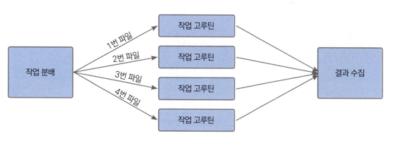

## 개선하기
ex25.2 구현은 모든 파일 검색을 하나의 main 고루틴에서 실행합니다.
물론, 검색할 파일이 몇개 안되면 상관 없지만 파일 개수가 늘어나면 검색에 오랜 시간이 듭니다.
고루틴을 사용해서 파일 개수가 늘어도 빠르게 검색되도록 개선해보겠습니다.
각 파일별로 작업을 할당하고 작업이 완료되면 채널을 이용해서 결과를 수집하는 방식을 사용하겠습니다.

이렇게 작업을 분배하고 다시 거둬들이는 방식을 뿌리고 거두기(Scatter-Gather) 방식이라고 합니다.